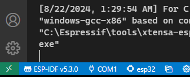
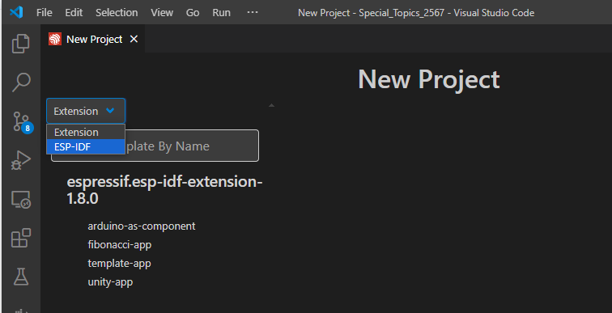
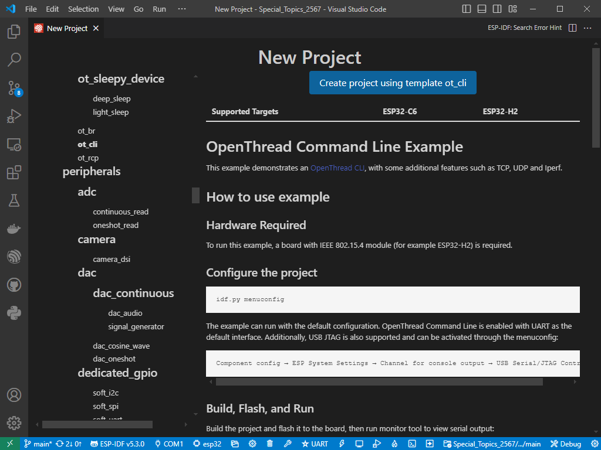

# การทดลองย่อยที่ 9.1 การใช้งาน ADC บน ESP32 ในโหมด oneshot_read

## 9.1.1 สร้าง project ใหม่ ชื่อ ESP32-Oneshot-read

###  หมายเหตุ
#### 1. การทดลองนี้ ใช้ ESP-IDF v5.3.0

#### 2. การทดลองนี้ เพื่อทดสอบระบบว่าสามารถทำงานได้ตามตัวอย่าง ดังนั้น code ที่เห็นอาจจะมีความซับซ้อนมากเกินกว่าที่จะสามารถเข้าใจได้ในเวลาอันรวดเร็ว นักศึกษาจะได้เขียน code อย่างง่ายที่ควบคุม ADC ได้เองในใบงานย่อยถัดไป

###  ลำดับขั้นการทดลอง

1. ไปที่เมนู View->Command pallete (หรือโดยการกด Ctrl+Shift+P  ใน vscode)

2. พิมพ์ `esp new` ในช่อง [ > ________]

3. กด Enter

4. ตั้งชื่อโปรเจคเป็น `ESP32-Oneshot-read` และเลือกที่ตั้งที่เหมาะสม (ชื่อโฟลเดอร์เป็นภาษาอังกฤษ ไม่ควรมีอักระพิเศษใดๆ ยกเว้น _ หรือ -)

5. คลิก Choose Template

6.  คลิกที่ Extension v แล้วเลือก ESP-IDF

7.  เลื่อนลงมาที่  peripherals / adc แล้วเลือก oneshot_read

8. คลิก `Create project using template oneshot_read`  ได้ project เมื่อเปิด main.c  จะได้ดังรูป 

9. เมื่อได้ project มาแล้ว ให้อ่านไฟล์ readme.md

13. ทดลอง  build โดยที่ยังไม่แก้ไขใดๆ เพื่อทดสอบว่า build ผ่านหรือไม่

14. เชื่อมต่อสาย jump จาก volume เข้ากับ ADC1 Channel4 (GPIO32) 

15. ดาวน์โหลดโปรแกรมลงบนบอร์ด พร้อมทั้งเปิด terminal ดูผลที่ได้จากการทำงานของโปรแกรมเมื่อหมุน volume ไปซ้ายสุดและขวาสุด ว่าเกิดอะไรขึ้นบ้าง 

16. ย้ายสาย jump จาก volume เข้ากับ ADC1 Channel5 (GPIO33)

17. สังเกตุผลที่ได้จากการทำงานของโปรแกรมเมื่อหมุน volume ไปซ้ายสุดและขวาสุด ว่าเกิดอะไรขึ้นบ้าง

