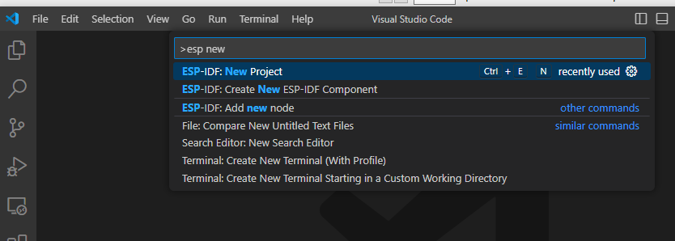
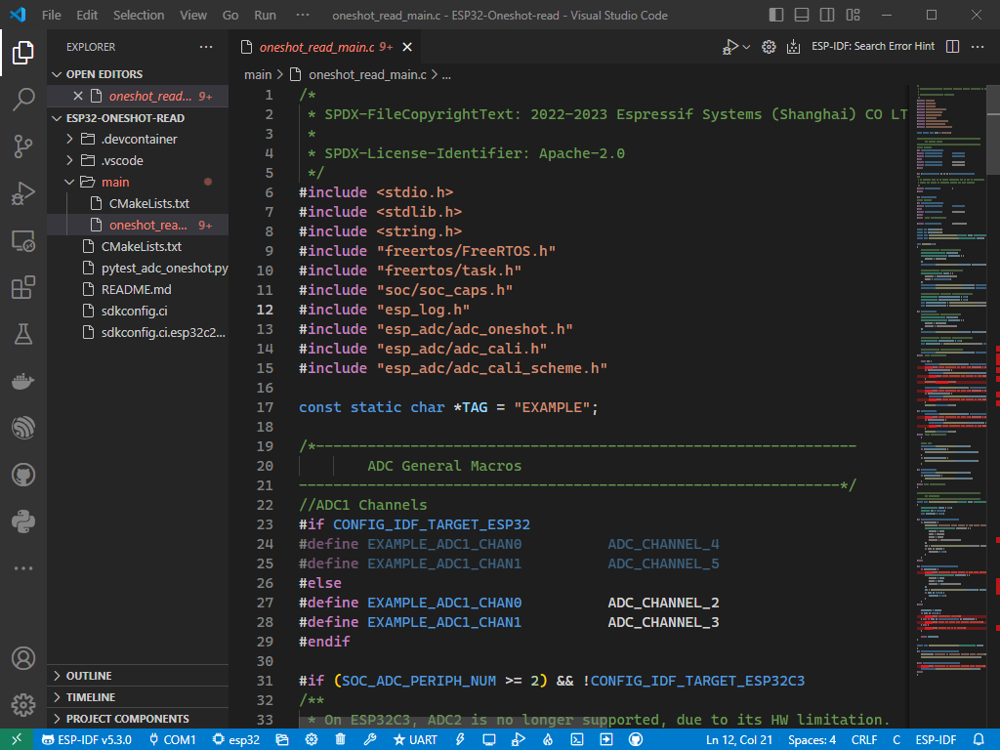

# การทดลองย่อยที่ 9.1 การใช้งาน ADC บน ESP32 ในโหมด oneshot_read

## 9.1.1 สร้าง project ใหม่ ชื่อ ESP32-Oneshot-read

###  หมายเหตุ
#### 1. การทดลองนี้ ใช้ ESP-IDF v5.3.0

#### 2. การทดลองนี้ เพื่อทดสอบระบบว่าสามารถทำงานได้ตามตัวอย่าง ดังนั้น code ที่เห็นอาจจะมีความซับซ้อนมากเกินกว่าที่จะสามารถเข้าใจได้ในเวลาอันรวดเร็ว นักศึกษาจะได้เขียน code อย่างง่ายที่ควบคุม ADC ได้เองในใบงานย่อยถัดไป

###  ลำดับขั้นการทดลอง

1. ไปที่เมนู View->Command pallete (หรือโดยการกด Ctrl+Shift+P  ใน vscode)

2. พิมพ์ `esp new` ในช่อง [ > ________]

3. กด Enter

4. ตั้งชื่อโปรเจคเป็น `ESP32-Oneshot-read` และเลือกที่ตั้งที่เหมาะสม (ชื่อโฟลเดอร์เป็นภาษาอังกฤษ ไม่ควรมีอักระพิเศษใดๆ ยกเว้น _ หรือ -)

5. คลิก Choose Template

6.  คลิกที่ Extension v แล้วเลือก ESP-IDF

7.  เลื่อนลงมาที่  peripherals / adc แล้วเลือก oneshot_read

8. คลิก `Create project using template oneshot_read`  ได้ project เมื่อเปิด main.c  จะได้ดังรูป 

9. เมื่อได้ project มาแล้ว ให้อ่านไฟล์ readme.md

13. ทดลอง  build โดยที่ยังไม่แก้ไขใดๆ เพื่อทดสอบว่า build ผ่านหรือไม่
    จากการทดลองพบว่า build ผ่าน

14. เชื่อมต่อสาย jump จาก volume เข้ากับ ADC1 Channel4 (GPIO32) 

15. ดาวน์โหลดโปรแกรมลงบนบอร์ด พร้อมทั้งเปิด terminal ดูผลที่ได้จากการทำงานของโปรแกรมเมื่อหมุน volume ไปซ้ายสุดและขวาสุด ว่าเกิดอะไรขึ้นบ้าง 

ผลที่ได้จากการหมุน volume จะเปลี่ยนแปลงค่าแรงดันไฟฟ้าบน ADC ต่าง ๆ ส่งผลให้ค่าดิบและค่าที่คาลิเบรตแล้วบนแต่ละช่องสัญญาณเปลี่ยนไป. การหมุนไปซ้ายสุดจะทำให้บางช่องมีแรงดันสูงสุดและบางช่องต่ำสุด ในขณะที่การหมุนไปขวาสุดจะเพิ่มแรงดันในบางช่องสัญญาณ

16. ย้ายสาย jump จาก volume เข้ากับ ADC1 Channel5 (GPIO33)

17. สังเกตุผลที่ได้จากการทำงานของโปรแกรมเมื่อหมุน volume ไปซ้ายสุดและขวาสุด ว่าเกิดอะไรขึ้นบ้าง

ซ้ายสุด
   ผลลัพธ์ที่ได้จาก ADC1 Channel[5] จะให้ค่า Raw Data สูงสุดที่ 4095 และ Cali Voltage ประมาณ 3139 mV
   ส่วน ADC2 Channel[0] และ ADC1 Channel[4] ให้ค่า Raw Data ต่ำสุดที่ 0 หรือค่าต่ำอื่น ๆ ที่ใกล้เคียงกัน และ Cali Voltage ในช่วงต่ำ เช่น 128 mV ถึง 877 mV

อธิบาย: เมื่อหมุน volume ไปซ้ายสุด อาจหมายถึงการลดแรงดันไปยังบางช่องสัญญาณ (เช่น Channel 4 และ 0) ในขณะที่ช่องสัญญาณอื่น (เช่น Channel 5) ยังคงได้รับแรงดันสูงสุด ซึ่งสะท้อนด้วยค่า Raw Data สูงสุด (4095)

ขวาสุด
   เมื่อตรวจสอบผลลัพธ์ในช่วงที่หมุน volume ไปขวาสุด ค่า Raw Data และ Cali Voltage ของ ADC1 Channel[4] เริ่มเพิ่มขึ้นจาก 0 ถึงค่า 1459 และ 1048 mV ตามลำดับ ซึ่งแสดงให้เห็นว่ามีการเพิ่มแรงดันไฟฟ้าขึ้นเมื่อ volume หมุนไปทางขวา

อธิบาย: การหมุน volume ไปขวาสุดอาจทำให้แรงดันไฟฟ้าเพิ่มขึ้นในบางช่องสัญญาณ (เช่น Channel 4) ซึ่งสะท้อนให้เห็นผ่านการเพิ่มขึ้นของค่าดิบและค่าที่คาลิเบรตแล้ว

นำขึ้นไปบน GIT HUB นี้คือ ลิงค์
https://github.com/AnchisaPhetnoi/ESP32-Oneshot-read-LAB-9.git
