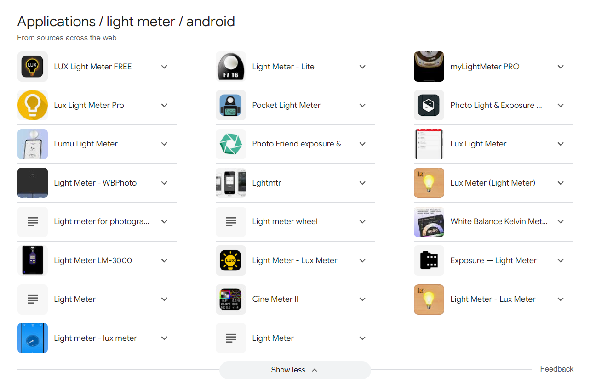

# การทดลองย่อยที่ 9.4  การใช้งาน ADC บน ESP32 ในโหมด oneshot_read เพื่ออ่านค่าจากเซนเซอร์วัด (LDR) 

## 1 การอ่านค่า raw จาก LDR
1.1 สร้าง Project  ใหม่ `ESP32-LDR-Oneshot` ใช้  `Template-app`

1.2 เพิ่ม code  ใน main.c

1.2.1 ส่วน include

1.2.2 ส่วนของการ config adc_oneshot variables และสร้าง handle ไว้ใช้งาน

1.2.3 ส่วนของการกำหนด adc channel

1.2.4 ส่วนของการ calibrate adc

1.2.5 ส่วนของ main loop

1.2.6 build และรันโปรแกรม ให้แสดงค่า raw data บน ternimal

## 2 การสอบเทียบ LDR ให้สามารถแสดงค่าทางกายภาพ

ในการใช้งานจริง เมื่อข้อมูลไปรวมกันอยู่เป็นจำนวนมาก ค่า raw ที่อ่านได้จาก adc มักจะไม่มีความหมายในตัว ผู้ใช้งานไม่สามารถแยกแยะค่าต่างๆ ได้ ทำให้เกิดการละเลย ไม่ใส่ใจ ค่าที่วัดได้ หรือไม่ให้ความสำคัญต่อระบบ

ดังนั้นนักศึกษาต้องเรียนรู้วิธีการแปลงค่าจากข้อมูลดิบทางดิจิทัล raw data ไปเป็นปริมาณทางกายภาพ physical quantity

2.1 ติดตั้ง application สำหรับวัดค่าแสง บนโทรศัพท์ smartphone

ตัวอย่าง application บนระบบ android

ตัวอย่าง application บนระบบ ios

2.2 เปิด application บน smartphone ให้แสดงค่าแสง แล้ววางโทรศัพท์ไว้ไว้ในที่ที่มีสภาพแสงเดียวกับ LDR

2.3 เปลี่ยนปริมาณแสง แล้วจดบันทึกค่าทั้งที่อ่านได้จาก LDR และ Smartphone โดยเปลี่ยนปริมาณแสงตั้งแต่  5 ระดับขึ้นไป เพื่อนำไปทำเป็นสมการ calibration transfer

2.4 นำค่าที่อ่านได้ทั้งจาก LDR และ Smartphone ใส่ใน Microsoft excel

2.5 ใน Microsoft excel พล็อตกราฟเป็นแบบ scatter plot 

2.6 เพิ่มเส้นแนวโน้มสำหรับเส้นกราฟ ให้แสดงค่าความละเอียดอย่างน้อย 4 จุดทศนิยม พร้อมทั้งแสดงสมการ

2.7 นำสมการที่ได้จากข้อ 2.6 ไปใช้คำนวณในโปรแกรม 

