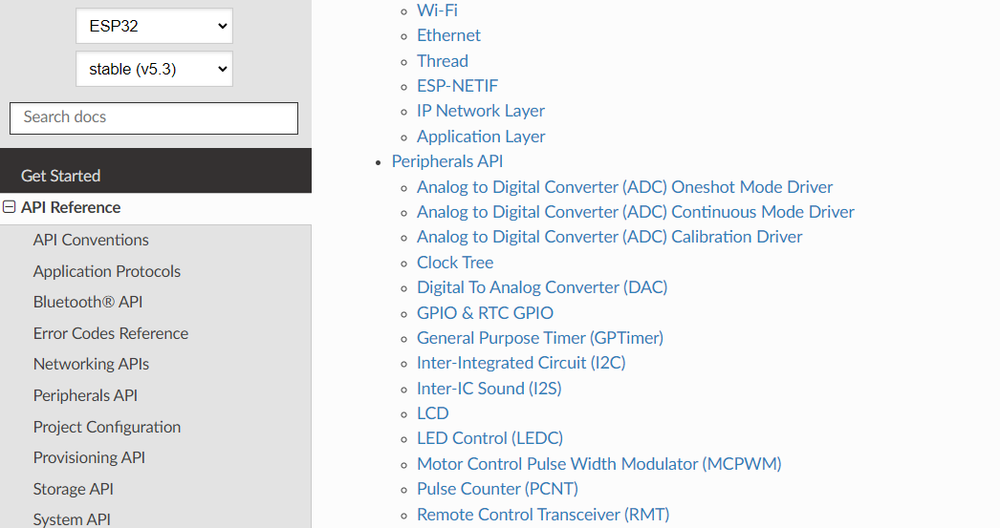
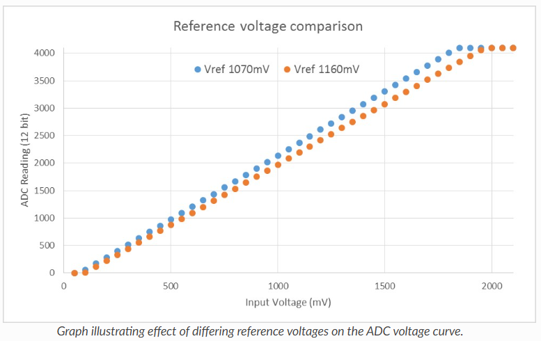

# ESP32 Analog input

ระบบ IoT เป็นระบบที่เชื่อมต่อโลกทางกายภาพเข้ากับโลกไซเบอร์หรือ เชื่อมต่อ analog domain เข้ากับ digital domain
หน่วยประมวลผลของระบบ IoT รวมทั้ง cloud ที่อยู่ใน digital domain ล้วนทำงานด้วย CPU และหน่วยความจำ ที่ต้องการข้อมูลอินพุตเพื่อประมวลผล
เนื่องจากปริมาณต่างๆ ทางกายภาพที่ใช้เป็นอินพุตและเอาต์พุตของระบบอยู่ภายนอก CPU ดังนั้นต้องมีวิธีการทำให้ CPU รับรู้ปริมาณเหล่านั้นได้โดยไม่ต้องมีการป้อนข้อมูลโดยมนุษย์เข้าไปข้องเกี่ยว

วิธีการหนึ่งที่ช่วยให้ CPU รู้จักสัญญาณทางภายภาพคือการนำเข้าทางวงจรแปลงสัญญาณ analog เป็น digital (Analog to Digital Converter เรียกย่อว่า ADC) ซึ่งภายในชิป ESP32 ได้มีการออกแบบและสร้างส่วน ADC ไว้ให้แล้ว โดยผู้ใช้จะต้องทำซอฟต์แวร์ที่เข้าใช้งานระบบดังกล่าวเอง

เนื้อหาเบื้องต้นเกี่ยวกับ  API ของ ADC ใน ESP32 สามารถเข้าถึงได้จากหน้าเพจนี้ [ADC - V4.7.7](https://docs.espressif.com/projects/esp-idf/en/v4.4.7/esp32/api-reference/peripherals/adc.html) 

ในส่วนของ API สำหรับ IDF รุ่นล่าสุด (V5.3) จะไม้ได้กล่าวถึงพื้นฐานของ ADC 
แต่นักศึกษาสามารถใช้ IDF รุ่น V4.7.7 เพื่ออ้างอิงได้ เนื่องจากใน IDF รุ่นถัดมาจะอธิบายเฉพาะส่วน API ที่พัฒนาขึ้นเท่านั้น

## Analog to Digital Converter (ADC) ใน ESP32

ภายใน ESP32 ประกอบด้วย ADC แบบ SAR (Successive Approximation Register) จำนวน 2 ตัว และรองรับช่องการวัดทั้งหมด 18 ช่อง 

อย่างไรก็ตาม ESP32 ที่มีวางจำหน่ายมีหลายรุ่น บางรุ่นอาจจะมีจำนวนขาใช้งานไม่ครบตามจำนวนที่กล่าวมา นักศึกษาสามารถศึกษาเพิ่มเติมได้จาก datasheet ของ ESP32 ตามที่อยู่นี้ [ESP32 Hardware references](https://docs.espressif.com/projects/esp-idf/en/v5.3/esp32/hw-reference/index.html)

ESP32 ที่ถูกออกแบบมาเต็มระบบ จะมีขาสำหรับเปิดรับสัญญาณ analog ดังต่อไปนี้

### 1. ADC1 จำนวน 8 ช่อง

|No| Padname |Function 1| Function 2| Function 3| Function 4| Function 5| Function 6| Reset | Notes| 
|:--:|:------:|:-----------:|:------:|:--:|:------:|:--:|:--:|:--:|:--:|
| 1  | GPIO32 | 32K_XP      | GPIO32 |  - | GPIO32 |  - |  - |  - |  0 | R    |
| 2  | GPIO33 | 32K_XN      | GPIO33 |  - | GPIO33 |  - |  - |  - |  0 | R    |
| 3  | GPIO34 | VDET_1      | GPIO34 |  - | GPIO34 |  - |  - |  - |  0 | R, I |
| 4  | GPIO35 | VDET_2      | GPIO35 |  - | GPIO35 |  - |  - |  - |  0 | R, I |
| 5  | GPIO36 | SENSOR_VP   | GPIO36 |  - | GPIO36 |  - |  - |  - |  0 | R, I |
| 6  | GPIO37 | SENSOR_CAPP | GPIO37 |  - | GPIO37 |  - |  - |  - |  0 | R, I |
| 7  | GPIO38 | SENSOR_CAPN | GPIO38 |  - | GPIO38 |  - |  - |  - |  0 | R, I |
| 8  | GPIO39 | SENSOR_VN   | GPIO39 |  - | GPIO39 |  - |  - |  - |  0 | R, I |

### 2. ADC2 จำนวน 10 ช่อง

|No|Padname |Function 1| Function 2| Function 3| Function 4| Function 5| Function 6| Reset | Notes| 
|:--:|:------:|:-----------:|:------:|:--:|:------:|:--:|:--:|:--:|:--:|
| 1  | GPIO0  | GPIO0  | CLK_OUT1| GPIO0  |    -      |  -       | EMAC_TX_CLK | 3 | R |
| 2  | GPIO2  | GPIO2  | HSPIWP  | GPIO2  |    -      |  -       |           - | 2 | R |
| 3  | GPIO4  | GPIO4  | HSPIHD  | GPIO4  | HS2_DATA1 | SD_DATA1 | EMAC_TX_ER  | 2 | R |
| 4  | MTDI   | MTDI   | HSPIQ   | GPIO12 | HS2_DATA2 | SD_DATA2 | EMAC_TXD3   | 2 | R |
| 5  | MTCK   | MTCK   | HSPID   | GPIO13 | HS2_DATA3 | SD_DATA3 | EMAC_RX_ER  | 2 | R |
| 6  | MTMS   | MTMS   | HSPICLK | GPIO14 | HS2_CLK   | SD_CLK   | EMAC_TXD2   | 3 | R |
| 7  | MTDO   | MTDO   | HSPICS0 | GPIO15 | HS2_CMD   | SD_CMD   | EMAC_RXD3   | 3 | R |
| 8  | GPIO25 | GPIO25 | GPIO25  |  -     |   -       |  -       | EMAC_RXD0   | 0 | R |
| 9  | GPIO26 | GPIO26 | GPIO26  |  -     |   -       |  -       | EMAC_RXD1   | 0 | R |
| 10 | GPIO27 | GPIO27 | GPIO27  |  -     |   -       |  -       | EMAC_RX_DV  | 0 | R |

## ADC Attenuation

ADC ของ ESP32 สามารถวัดสัญญาณ analog ได้ที่ความละเอียด (resolution) 4 ระดับ โดยแต่ละระดับความละเอียดจะมีความสามารถตรวจวัดสัญญาณได้ต่างกัน ทั้งย่านแรงดันทีวัดได้และรายละเอียดของสัญญาณ 

|    Attenuation   | Measurable input voltage range |
| ---------------  | ------------------------------ |
| ADC_ATTEN_DB_0   | 100 mV ~ 950 mV                |
| ADC_ATTEN_DB_2_5 | 100 mV ~ 1250 mV               |
| ADC_ATTEN_DB_6   | 150 mV ~ 1750 mV               |
| ADC_ATTEN_DB_11  | 150 mV ~ 2450 mV               |

## API สำหรับการแปลง analog to digital

การแปลง ADC คือการแปลงแรงดันไฟฟ้าอนาล็อกอินพุตเป็นค่าดิจิทัล ผลลัพธ์การแปลง ADC ที่ได้รับจาก API ไดรเวอร์ ADC เป็นข้อมูลดิบ ความละเอียดของผลลัพธ์ดิบของ ESP32 ADC ภายใต้โหมด Single Read คือ 12 บิต

โดยใน ESP-IDF มี API สองตัวคือ 

1. `adc1_get_raw()` สำหรับอ่านค่าข้อมูลติดจาก  ADC ช่องที่ 1

2. `adc2_get_raw()` สำหรับอ่านค่าข้อมูลติดจาก  ADC ช่องที่ 1

เมื่อได้ข้อมูลดิบ (raw value)  ซึ่งมีค่าในช่วง 0 ถึง 4096 มาแล้ว เราสามารถแปลงให้เป็นค่่าทางกายภาพได้ตามสมการต่อไปนี้

`Vout = Dout * Vmax / Dmax`

โดยที่ตัวแปรแต่ละตัวมีความหมายดังนี้

|   ตัวแปร |ความหมาย|
|------- | ----------------|
| Vout   | ผลลัพธ์เอาท์พุตดิจิทัล แสดงถึงแรงดันไฟฟ้า (ปริมาณทางกายภาพ)|
| Dout   | ผลการอ่านค่า raw ในรูปแบบ digital จาก ADC|
| Vmax   | แรงดันไฟฟ้าอนาล็อกอินพุตที่วัดได้สูงสุด(จากการตั้งค่าใน ADC Attenuation) |
| Dmax   | ค่าสูงสุดของค่า digital ที่ได้จากการแปลง (มีค่าเป็น 4095 ในโหมดการอ่าน 12 บิต) |

## ข้อจำกัดของ ADC

ถึงแม้ว่าการออกแบบวงจรภายในของชิป จะตั้งใจให้สามารถแปลงค่าสัญญาณต่ำสุด (0 โวลต์)  ไปจนถึงสูงสุด (3.3 โวลต์) ในแบบเชิงเส้น แต่ด้วยข้อจำกัดทางวงจร ทำให้ ADC ไม่สามารถแปลงสัญญาณแบบเชิงเส้นได้ตลอดย่าน ในการใช้งานจริง นักศึกษาต้องทดสอบและยืนยันย่านวัดสูงสุดที่ทำได้จริงเสมอ และออกแบบวงจรให้มีแรงดันขาเข้าอยู่ภายในระดับที่ยอมรับได้

